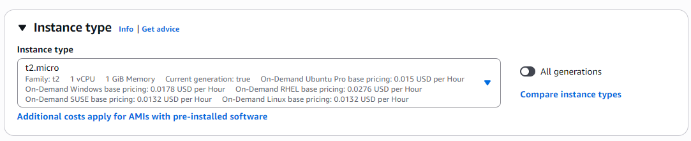
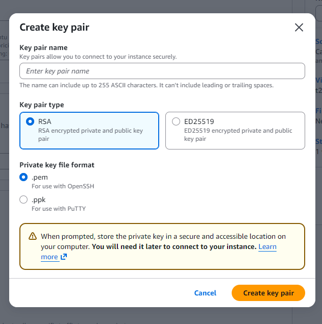
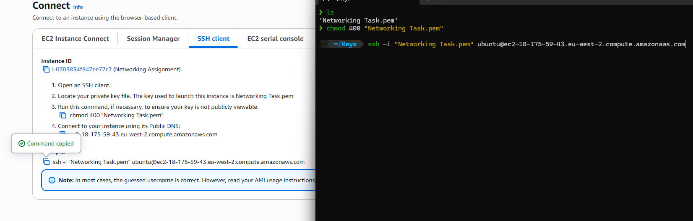
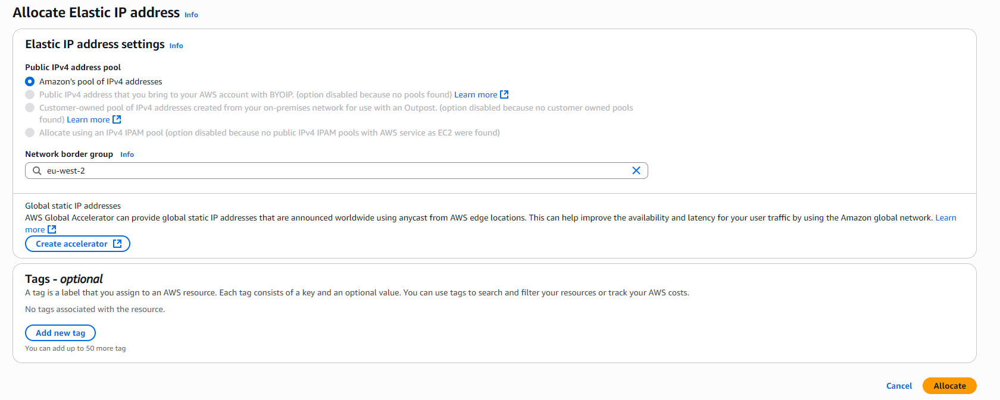
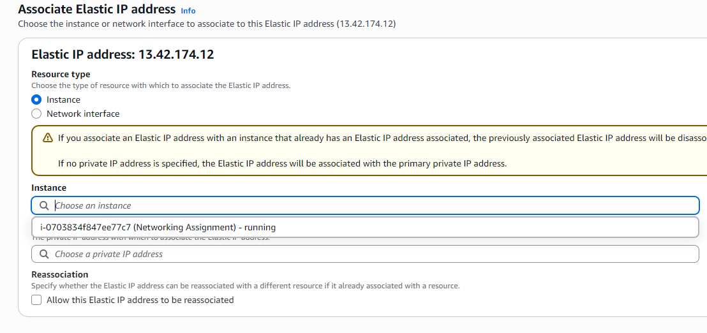

# Networking Assignment  ## Running Nginx on EC2 instance and linking it to a domain from Route 53
### In this assignment I will show you how to purchase a domain from AWS Route 53 and then link it to an EC2 istance. 
### The instance will run nginx on port 80, but then I will also show how to enable HTTPS because of the security, nginx will be accessed on port 443.

### I will also explain and show how to customise the front end interface of the nginx and also how to create an elastic IP adress.

### Step 1: Buy a domain in Route 53:
Navigate to AWS Rote 53 and press **Get started**. Choose the option **Register a domain** and press **Get started**.

</img>

Choose a domain that is available. Observe the price, there are some expensive and cheap domains, then proceed to checkout.

### Step 2: Launch an EC2 instance:
Navigate to EC2 and press **Launch Instance**. Choose **Ubuntu** as the application.

</img>

At the instance type section, choose **t2.micro**. 

</img>

Under the key pair section, create a new key pair. Enter a name, choose **RSA** as type and **.pem** as private key file format.

</img>

In Network settings, configure the security group by creating a new security group and check all the boxes, allow SSH from **My IP** and allow HTTP and HTTPS from internet.

</img>

Now you have configured your instance, launch it!

### Step 3: SSH in to the EC2 instance:
Once the instance is launched, mark the instance and press **Connect**. 
Choose **SSH client** tab and follow these steps:

- Enter the terminal  
- Navigate to the directory where the .pem file is  
- Run this command to set the file as read-only for the owner and no one else can read, write or execute the file:

**chmod 400 "<name_of_pem_file>.pem"**

- Copy the command at the bottom and run it in the terminal for connecting to the instance:

**ssh -i "<name_of_pem_file>.pem" ubuntu@ec2-18-175-59-43.eu-west-2.compute.amazonaws.com**

</img>

### Step 4: Create and allocate elastic IP address:
On AWS's sidebar, find **Elastics IPs** under **Network & Security** section and enter it.
Press **Allocate IP address** and then press **Allocate**

</img>

At this point you have created an elastic IP address, but now it has to be associated/assigned to the running instance you have created.   
Mark the elastic IP address and go to **Actions** and press **Associate Elastic IP address** to assign it your instance.   
Choose your running instance and press **Associate**.

</img>

Why are you assigning an elastic IP address to your instance?  
Because every time you stop your instance and then rerun it again, the instance's public IP address will change and will not be the same as the previous one. This will cause you to link the new IP address to your domain everytime.  
With the elastic IP address, it will stay the same all the time.  
In the next step I will show you how to link the public IP address/Elastic IP address of your instance to your domain.

### Step 5: Linking the IP address to your domain

