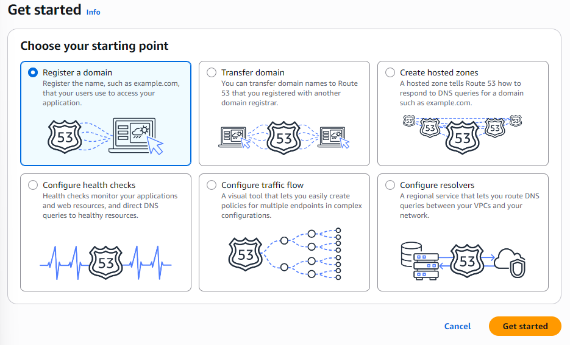
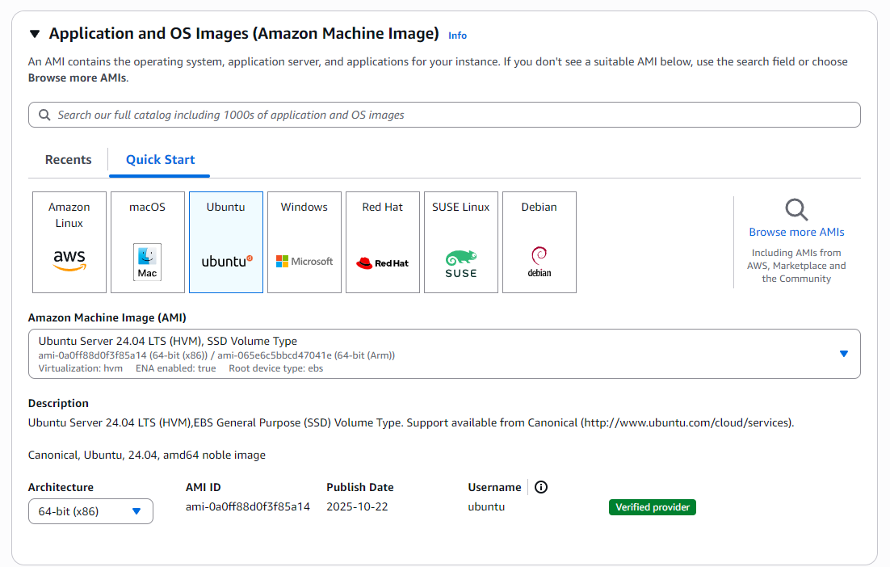
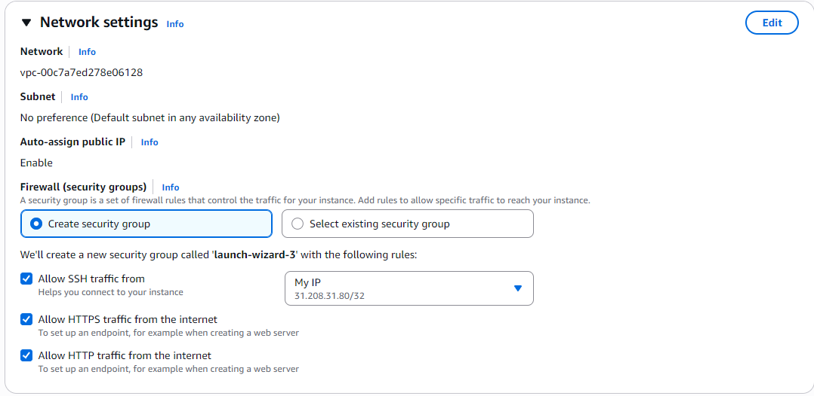
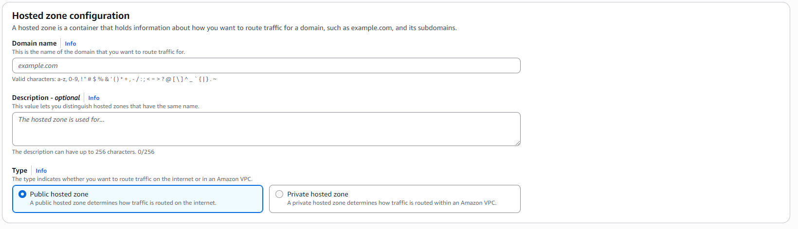
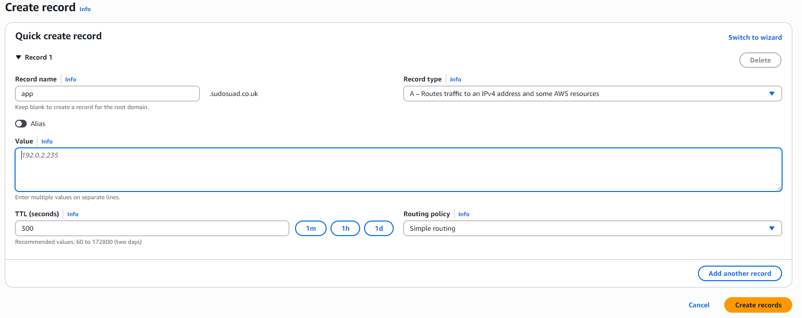
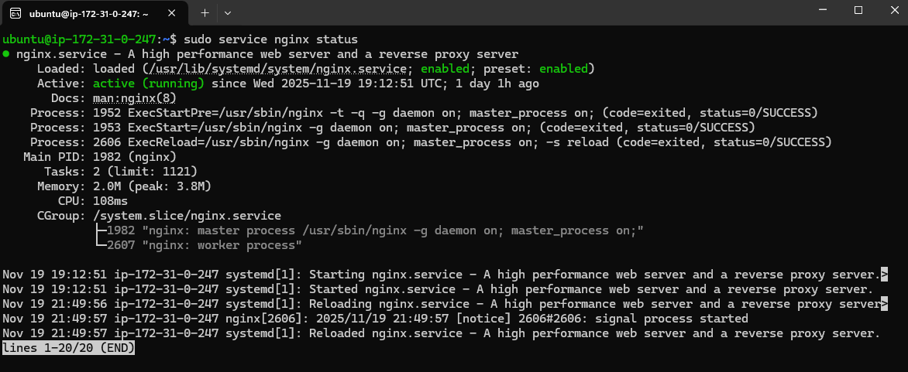
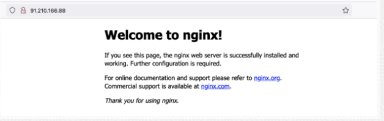
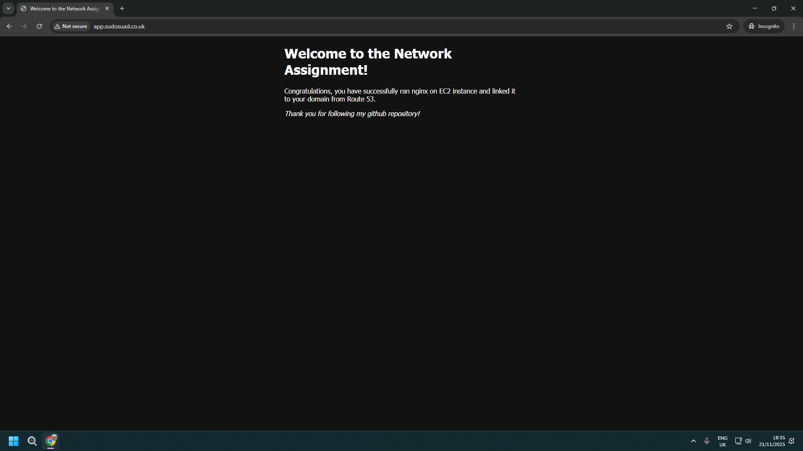

## Networking Assignment  
Running Nginx on EC2 instance and linking it to a domain from Route 53.  
In this assignment I will show you how to purchase a domain from AWS Route 53 and then link it to an EC2 istance.   
The instance will run nginx on port 80.  
I will also explain and show how to customise the front end interface of the nginx and also how to create an elastic IP adress.

### Step 1: Buy a domain in Route 53:
Navigate to AWS Rote 53 and press **Get started**. Choose the option **Register a domain** and press **Get started**.

</img>

Choose a domain that is available. Observe the price, there are some expensive and cheap domains, then proceed to checkout.

### Step 2: Launch an EC2 instance:
Navigate to EC2 and press **Launch Instance**. Choose **Ubuntu** as the application.

</img>

At the instance type section, choose **t2.micro**. 

</img>

Under the key pair section, create a new key pair. Enter a name, choose **RSA** as type and **.pem** as private key file format.

</img>

In Network settings, configure the security group by creating a new security group and check all the boxes, allow SSH from **My IP** and allow HTTP and HTTPS from internet.

</img>

Now you have configured your instance, launch it!

### Step 3: SSH in to the EC2 instance:
Once the instance is launched, mark the instance and press **Connect**. 
Choose **SSH client** tab and follow these steps:

- Enter the terminal  
- Navigate to the directory where the .pem file is  
- Run this command to set the file as read-only for the owner and no one else can read, write or execute the file:

**chmod 400 "<name_of_pem_file>.pem"**

- Copy the command at the bottom and run it in the terminal for connecting to the instance:

**ssh -i "<name_of_pem_file>.pem" ubuntu@ec2-18-175-59-43.eu-west-2.compute.amazonaws.com**

</img>

### Step 4: Create and allocate elastic IP address:
On AWS's sidebar, find **Elastics IPs** under **Network & Security** section and enter it.
Press **Allocate IP address** and then press **Allocate**

</img>

At this point you have created an elastic IP address, but now it has to be associated/assigned to the running instance you have created.   
Mark the elastic IP address and go to **Actions** and press **Associate Elastic IP address** to assign it your instance.   
Choose your running instance and press **Associate**.

</img>

**Why are you assigning an elastic IP address to your instance?**   

Because every time you stop your instance and then rerun it again, the instance's public IP address will change and will not be the same as the previous one.  
This will cause you to link the new IP address to your domain everytime.  
With the elastic IP address, it will stay the same all the time.

In the next step I will show you how to link the public IP address/Elastic IP address of your instance to your domain.

### Step 5: Linking the IP address to your domain
To link the instance's public IP address/elastic IP address, you have to create an A record on your domain and point it to your instance.  
This is done by following steps:

- Navigate to **Hosted zones** in Route 53
- Click on **Create hosted zone**
- Configure it by calling it to your purchased domain name and mark it as **Public hosted zone** and then press **Create hosted zone**

</img>

- Press **Create record**
- Type a subdomain name or keep it blank to create a record for the root domain
- Choose **A - Routes traffic to an IPv4 address and some AWS resources** as the record type
- Add the public IP/elastic IP address to the **Value** section.
- Press **Create records**

</img>

Now you have created a hosted zone to be able to link the instance's IP address to your domain by an A record.

**What is an A record and how does it work?**

The "A" stands for Address and is the most used type of DNS, Domain Name System, record.  
It maps a human-readable domain name to the numerical IPv4 address.  
Basically, with A record, you can search on your web browser for domain names instead of IP addresses. 

This information is stored in DNS and this is how it works when you search for a website's domain in your web browser:

- Web browser doesn't know where to go so it calls the DNS resolver.
- If the DNS resolver remembers the dmain from it's cache memory, it will respond, otherwise it will call the Root Server.
- The Root Server knows which server knows the answer and responds with an IP address to that TLD (Top_Level Domain) server.
- The TLD server responds with an IP address to an Authoritative Nameserver which manages the domain's IP address.
- The Nameserver sends back the right IP address of the domain to the DNS resolver.
- Then the DNS resolver sends it to your web browser and you can access the website.

Let's move on to the next step!

### Step 6: Installing and running nginx on the instance:
To be able to run nginx on your instance, you have to install it first by the following steps:

- Go to your instance in the terminal
- Run these commands separately to install nginx: 

**sudo apt update**  
**sudo apt install nginx**

- Run nginx with following command:

**sudo service nginx start**

- Check the status of nginx with the following command:

**sudo service nginx status**

</img>

Now your nginx is running in the instance!
Search the instance's IP address or your domain name on the web browser and the nginx webpage should pop up:

</img>

### Step 7: Customise the nginx's HTML:
Let's make it a little bit special! Let's customise the HTML/ front end interface of the nginx webpage to make it standout.  
Follow these steps:

- Navigate to the directory where the nginx's HTML file is located:

**cd /var/www/html**

- Enter the file with text editor:

**sudo vim index.nginx-debian.html**

- Edit the text to your liking.
- Save the changes and reload nginx with the following commands:

**sudo nginx -t**  
**sudo systemctl reload nginx**

</img>

Now go to your web browser and refresh the page.  
You should see your new changes active:

</img>

