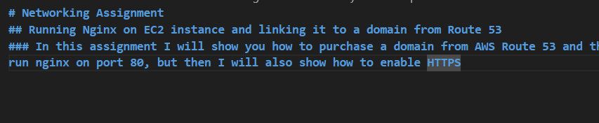

# Networking Assignment 
## Running Nginx on EC2 instance and linking it to a domain from Route 53
### In this assignment I will show you how to purchase a domain from AWS Route 53 and then link it to an EC2 istance. The instance will run nginx on port 80, but then I will also show how to enable HTTPS because of the security, nginx will be accessed on port 443.

### At the end I will also explain and show how to customise the front end interface of the nginx and also how to create an elastic IP adress.

### Step 1:

 </img>
